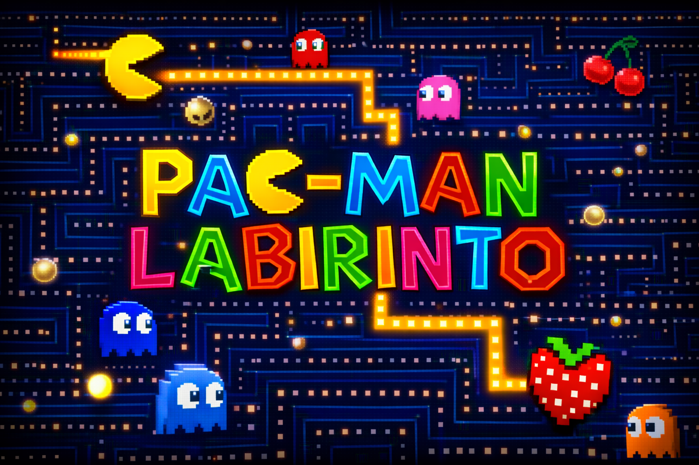

# Pac-Man Labirinto

<p align="center">
  
</p>

**Pac-Man Labirinto** é um framework didático em Python/Pygame para estudar algoritmos de busca em Inteligência Artificial. O Pac-Man deve encontrar o morango em um labirinto representado como um grid bidimensional. As paredes restringem a movimentação, o morango representa o objetivo, e os fantasmas são usados visualmente para representar a fronteira de exploração dos algoritmos.

O objetivo pedagógico é permitir que estudantes implementem e comparem algoritmos clássicos de busca, mantendo a visualização, a animação e a lógica do ambiente encapsuladas no framework.

## Requisitos

- Python 3.10+
- `pygame`
- `Pillow`

Instalação, a partir da raiz do projeto:

```bash
pip install -r requirements.txt
```

## Como executar

A estrutura atual do projeto possui o código executável dentro da pasta `pacman_labyrinth/`.

### Jogo com menu em Pygame

Entrando na pasta do projeto:

```bash
cd pacman_labyrinth
python main.py
```

### Rodar um agente no terminal

A partir da pasta `pacman_labyrinth/`:

```bash
python scripts/run_agent.py --map maps/maze_10x10.txt --agent random --max-steps 1000
```

Agentes disponíveis no script de terminal:

- `random`
- `bfs`
- `dfs`
- `ucs`
- `greedy`
- `astar`
- `dijkstra`

Observação: `bfs`, `dfs`, `ucs`, `greedy` e `astar` são arquivos de atividade para implementação pelos estudantes. Enquanto estiverem com `NotImplementedError`, eles não executam no terminal nem no menu.

### Rodar em modo manual direto

```bash
python pacman_labyrinth/scripts/play_manual.py
```

Ou, a partir da pasta `pacman_labyrinth/`:

```bash
python scripts/play_manual.py
```

## Controles

### Menu

- Mouse: clicar nos botões.
- `RIGHT` ou `SPACE`: selecionar o próximo mapa.
- `ENTER`: executar o agente selecionado.
- `ESC`: sair.

### Jogo

- `W`, `A`, `S`, `D`: mover o Pac-Man.
- Setas direcionais: mover o Pac-Man.
- `SPACE`: esperar.
- `TAB`: revelar/esconder o mapa completo.
- `R`: reiniciar o episódio.
- `ESC`: voltar ao menu.

## Estrutura do projeto

```text
Pac-Man-Maze/
├── README.md
├── requirements.txt
├── LICENSE
├── 08 - Labirinto.pdf
└── pacman_labyrinth/
    ├── main.py
    ├── maps/
    │   ├── maze_10x10.txt
    │   ├── maze_20x20.txt
    │   ├── maze_30x30.txt
    │   ├── maze_40x40.txt
    │   ├── maze_50x50.txt
    │   ├── maze_60x60.txt
    │   ├── maze_70x70.txt
    │   ├── maze_80x80.txt
    │   ├── maze_90x90.txt
    │   └── maze_100x100.txt
    ├── scripts/
    │   ├── play_manual.py
    │   └── run_agent.py
    ├── tests/
    │   ├── conftest.py
    │   └── test_env_smoke.py
    └── pacman_labyrinth/
        ├── __init__.py
        ├── app.py
        ├── config.py
        ├── core/
        │   ├── actions.py
        │   ├── env.py
        │   ├── generate_maps.py
        │   ├── map_loader.py
        │   └── models.py
        ├── agents/
        │   ├── base.py
        │   ├── search_agent_base.py
        │   ├── manual.py
        │   ├── random_agent.py
        │   ├── dijkstra.py
        │   ├── bfs.py
        │   ├── dfs.py
        │   ├── ucs.py
        │   ├── greedy.py
        │   └── a_star.py
        ├── search/
        │   ├── algorithms.py
        │   └── problems.py
        ├── render/
        │   ├── assets.py
        │   ├── renderer.py
        │   └── ui.py
        └── assets/
            └── ...
```

## Conceitos do ambiente

- **Pac-Man** = agente que se move no labirinto.
- **Morango** = objetivo final.
- **Paredes** = obstáculos não atravessáveis.
- **Fantasmas** = representação visual da fronteira de busca.
- **Células expandidas** = estados já processados pelo algoritmo.
- **Caminho final** = sequência de ações retornada pelo algoritmo de busca.

O mundo é modelado como um grid bidimensional. Cada célula pode representar:

- `UNKNOWN = -1`: célula desconhecida.
- `FREE = 0`: caminho livre.
- `WALL = 1`: parede.
- `EXIT = 2`: saída/objetivo.

Na configuração padrão atual, o mapa completo e a posição do objetivo são conhecidos desde o início (`full_observability=True` e `known_goal=True`). 

O código também permite ativar observação parcial usando `MazeConfig(full_observability=False, known_goal=False)`.

## Formato dos mapas

Os mapas ficam em `pacman_labyrinth/maps/` e são arquivos `.txt`.

Formato com metadados:

```text
START 0 0 EXIT 9 9
0010000000
0010111110
0000100000
1110101110
0000100010
0111111010
0000001010
0111101010
0100000010
0001111110
```

Também é possível usar `S` para início e `E` ou `2` para saída dentro do grid.

Semântica das células:

- `0`: célula livre.
- `1`: parede.
- `S`: posição inicial.
- `E` ou `2`: objetivo.

## API do ambiente

Uso típico:

```python
from pacman_labyrinth.config import MazeConfig
from pacman_labyrinth.core.env import MazeEnv
from pacman_labyrinth.core.actions import Action

config = MazeConfig(map_path="maps/maze_20x20.txt")
env = MazeEnv(config)
percept = env.reset()

done = False
while not done:
    action = Action.WAIT
    transition = env.step(action)
    percept = transition.percept
    done = transition.done
```

O método `env.step(action)` aplica uma ação e retorna um objeto `Transition` com:

- `percept`: nova percepção do agente.
- `reward`: recompensa do passo.
- `done`: indica se o episódio terminou.
- `info`: informações auxiliares.
- `action`: ação aplicada.

## Como criar um agente simples

Crie uma classe derivada de `BaseAgent` e implemente o método `act`.

```python
from pacman_labyrinth.agents.base import BaseAgent
from pacman_labyrinth.core.actions import Action
from pacman_labyrinth.core.models import Percept

class MeuAgente(BaseAgent):
    def __init__(self):
        super().__init__(algorithm="meu_agente")

    def reset(self):
        return None

    def act(self, percept: Percept, legal_actions: list[Action]) -> Action:
        return Action.WAIT
```

## Como implementar um agente de busca

Para os algoritmos de busca, os estudantes devem implementar o método `search` em uma classe derivada de `SearchAgentBase`.

Exemplo mínimo:

```python
from __future__ import annotations

from .search_agent_base import SearchAgentBase
from ..search.algorithms import SearchResult

class MeuAgenteDeBusca(SearchAgentBase):
    algorithm_name = "meu_algoritmo"

    def search(self, problem) -> SearchResult:
        return problem.failure()
```

Arquivos principais para a atividade:

- `pacman_labyrinth/pacman_labyrinth/agents/bfs.py`
- `pacman_labyrinth/pacman_labyrinth/agents/dfs.py`
- `pacman_labyrinth/pacman_labyrinth/agents/ucs.py`
- `pacman_labyrinth/pacman_labyrinth/agents/greedy.py`
- `pacman_labyrinth/pacman_labyrinth/agents/a_star.py`
- `pacman_labyrinth/pacman_labyrinth/search/problems.py`

A classe `GridPlanningProblem` fornece métodos importantes para a implementação:

- `problem.start`: posição inicial.
- `problem.goal`: posição objetivo.
- `problem.is_goal(pos)`: teste de objetivo.
- `problem.successors(pos)`: sucessores válidos.
- `problem.heuristic(pos)`: heurística, necessária para Greedy e A*.
- `problem.fifo_frontier()`: fronteira FIFO para BFS.
- `problem.lifo_frontier()`: fronteira LIFO para DFS.
- `problem.priority_frontier()`: fila de prioridade para UCS, Greedy e A*.
- `problem.solution(actions, path, cost, found=True)`: cria um resultado de sucesso.
- `problem.failure()`: cria um resultado de falha.

A função `reconstruct_path` em `search/algorithms.py` pode ser usada para reconstruir o caminho final a partir de um dicionário de predecessores.

## Algoritmos da atividade

### Exercício A: busca sem informação

Implementar:

- BFS - Busca em Largura.
- DFS - Busca em Profundidade.
- UCS - Busca de Custo Uniforme.

### Exercício B: busca com informação

Implementar:

- Greedy Best-First Search - Busca Gulosa.
- A* - A-estrela.

Para Greedy e A*, implemente também a heurística em `pacman_labyrinth/pacman_labyrinth/search/problems.py`. 

## Entrega sugerida

Entregar:

- Projeto compactado com os arquivos dos algoritmos implementados.
- Relatório curto em PDF.

O relatório pode conter:

1. Identificação: nome, RA e data.
2. Visão geral do problema.
3. Algoritmos de busca sem informação.
4. Algoritmos de busca com informação.
5. Testes realizados e diferenças observadas entre os agentes.
6. Declaração de uso de IA, caso tenha sido usada.
7. Melhorias, limitações e sugestões para versões futuras.

## Observações para desenvolvimento

- Evite modificar os arquivos centrais do ambiente, renderização e carregamento de mapas, exceto quando necessário.
- Priorize modificar os arquivos dentro de `agents/` e, para Greedy/A*, a função `heuristic` em `search/problems.py`.
- A animação da fronteira, dos nós expandidos e do caminho final é responsabilidade do framework.
- O estudante deve focar na lógica do algoritmo de busca.
